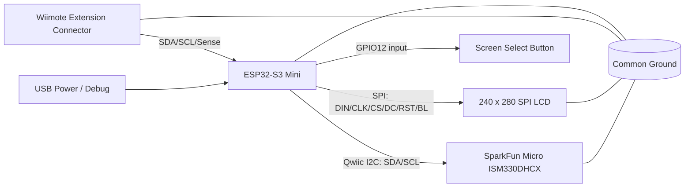

# Wii Motion Pro Prototype: Hardware Description and Wiring Diagram

**Prototype goal:** build a compact Wii MotionPlus-compatible experimental module using an ESP32-S3, a 240 x 280 SPI display, and a SparkFun Micro 6DoF ISM330DHCX IMU. The first prototype should prioritize safe bring-up, clean bus separation, IMU calibration, and a debug UI before attempting full Wii MotionPlus protocol emulation.

---

## 1. Hardware you have

### Main controller

- **ESP32-S3 Mini development module**, likely Waveshare ESP32-S3 Mini or similar.
- Runs firmware for:
  - Internal IMU acquisition.
  - LCD status/debug UI.
  - Calibration and profile storage.
  - Wii extension-side emulation.

### Wii extension connector harness

You reported the following wire colors:

| Wire color | Label | Assumed function | Notes |
|---|---|---|---|
| Red | `GND` | Ground | Connect to ESP32 ground. |
| Gray | `SDA` | Wii extension I2C data | Dedicated Wii-side data line. |
| White | `SCL_S` | Wii extension I2C clock | Dedicated Wii-side clock line. |
| Black | `TRIG_S` | Sense / detect | Treat as accessory detect/sense line until measured. |
| Blue | `+3.3V` | Wiimote accessory power | Use as reference/sense initially, not as main prototype power. |

The Wii extension connector pinout is normally 3.3 V nominal VCC, SCL, Sense, unused, SDA, and ground. The Sense line is pulled high by connected devices for accessory detection. [ConsoleMods, Wii connector pinouts](https://consolemods.org/wiki/Wii%3AConnector_Pinouts)

### Display

You have a **240 x 280 IPS SPI display module** with these pins:

| Display pin | Function |
|---|---|
| `VCC` | Display module supply |
| `GND` | Ground |
| `DIN` | SPI MOSI/data input |
| `CLK` | SPI clock |
| `CS` | SPI chip select |
| `DC` | Data/command select |
| `RST` | Display reset |
| `BL` | Backlight control |

The Waveshare 1.69 inch LCD module class uses a 240 x 280 IPS LCD, SPI interface, and ST7789V2 controller; its pin table lists VCC, GND, DIN, CLK, CS, DC, RST, and BL. [Waveshare wiki](https://www.waveshare.com/wiki/1.69inch_LCD_Module), [Waveshare product page](https://www.waveshare.com/1.69inch-lcd-module.htm)

### IMU

You ordered the **SparkFun Micro 6DoF IMU - ISM330DHCX (Qwiic)**.

Relevant properties:

- STMicroelectronics **ISM330DHCX** 6-axis IMU.
- 3-axis accelerometer plus 3-axis gyroscope.
- Qwiic/I2C connector.
- SparkFun micro board size is approximately **0.75 x 0.30 inches**.
- Supply voltage range: **1.71 V to 3.6 V**.
- Suitable for high-performance motion sensing, vibration monitoring, stabilization, robotics, and industrial automation style use cases.

SparkFun documents both the full-size and Micro versions in their hookup guide. [SparkFun hookup guide](https://learn.sparkfun.com/tutorials/qwiic-6dof---ism330dhcx-hookup-guide/all), [SparkFun product page](https://www.sparkfun.com/sparkfun-micro-6dof-imu-ism330dhcx-qwiic.html)

---

## 2. Design principle: keep three electrical domains separate

The prototype should use **three separate communication domains**:

```text
Domain A: Wii-side bus
  Wiimote connector SDA/SCL/Sense
  ESP32 behaves as a Wii extension/MotionPlus-like peripheral

Domain B: Internal sensor bus
  ESP32 talks to ISM330DHCX over Qwiic/I2C

Domain C: Display bus
  ESP32 talks to 240 x 280 LCD over SPI
```

Do not put the IMU, LCD, and Wii extension bus on the same I2C/SPI wiring. The Wii bus has protocol-specific timing and initialization behavior, while the IMU and LCD are internal peripherals.

---

## 3. Power architecture

### Recommended first-bench configuration

For first bring-up, power the ESP32 and internal electronics from USB:

```text
USB-C / USB power
    ↓
ESP32-S3 board regulator
    ↓
3.3 V rail for IMU and display logic
```

Then connect to the Wii connector only for logic/reference:

```text
ESP32 GND ↔ Wii connector GND
ESP32 GPIO ↔ Wii SDA/SCL/Sense
Wiimote +3.3 V ↔ measure/sense only at first
```

### Why not power everything from the Wiimote +3.3 V line?

The Wiimote extension port provides 3.3 V accessory power, but your prototype includes:

- ESP32-S3.
- Backlit IPS LCD.
- IMU.
- Possibly buttons, LEDs, and later battery charging.

The current budget may exceed what the Wiimote accessory rail is comfortable supplying. For safe development, do not draw the whole prototype load from the Wiimote until measured.

### Suggested later power options

| Option | Description | Best use |
|---|---|---|
| USB-powered bench prototype | ESP32 powered from USB, GND shared with Wiimote | Firmware and protocol development |
| Dedicated LiPo prototype | LiPo + 3.3 V regulator powers ESP32/LCD/IMU | Standalone accessory testing |
| Wiimote-powered final low-power version | Accessory rail powers everything | Only if measured current is safe |
| Hybrid | Wiimote rail used for detection/reference, local battery powers module | Most robust for display-equipped version |

---

## 4. Proposed ESP32-S3 pin assignment

Because ESP32-S3 Mini board pin exposure varies by exact board revision, treat this as a **pin plan**, not an absolute assignment. Choose GPIOs that are exposed on your board, are not USB D+/D-, and are not dangerous boot strapping pins unless you confirm they are safe.

### Suggested logical pin map

| Function | ESP32 signal name | Suggested GPIO class | Notes |
|---|---|---|---|
| LCD DIN | `LCD_MOSI` | SPI MOSI-capable GPIO | Display data input. |
| LCD CLK | `LCD_SCK` | SPI SCK-capable GPIO | Display clock. |
| LCD CS | `LCD_CS` | Any output GPIO | Active low. |
| LCD DC | `LCD_DC` | Any output GPIO | Data/command. |
| LCD RST | `LCD_RST` | Any output GPIO | Can be tied to EN/reset only if library supports it. |
| LCD BL | `LCD_BL` | PWM-capable GPIO | Or tie to 3.3 V for always-on backlight. |

### Confirmed LCD pin map (prototype)

These GPIO assignments match `firmware/screen_demo/include/display_pins.h` and the ESP32-S3 Mini breakout header (GPIOs 0–13). They follow the Waveshare 1.69" ST7789V2 SPI layout, with **BL on GPIO 9** instead of GPIO 15 because the Mini breakout does not expose GPIO 15.

| LCD module pin | Firmware signal | ESP32 GPIO | Notes |
|---|---|---:|---|
| `DIN` | `LCD_MOSI` | **7** | SPI data in. |
| `CLK` | `LCD_SCK` | **6** | SPI clock. |
| `CS` | `LCD_CS` | **5** | Active low chip select. |
| `DC` | `LCD_DC` | **4** | Data/command select. |
| `RST` | `LCD_RST` | **8** | Display reset. |
| `BL` | `LCD_BL` | **9** | Backlight PWM (or tie BL to 3.3 V). |
| `VCC` | — | **3.3 V** | Module power. |
| `GND` | — | **GND** | Common ground. |

Wii harness uses left-header **GPIO 1 / 2 / 3** (`WII_SDA` / `WII_SCL` / `WII_SENSE`). IMU I2C uses **GPIO 10 / 11**. Screen-select button on **GPIO 12** (`BTN_GPIO`). Optional microSD MISO on **GPIO 13**. See [`motion_pro_pinout.md`](motion_pro_pinout.md).

### Remaining peripherals (not yet assigned)

| Function | ESP32 signal name | Suggested GPIO class | Notes |
|---|---|---|---|
| IMU SDA | `IMU_SDA` | Internal I2C SDA | Qwiic bus; suggested GPIO 11. |
| IMU SCL | `IMU_SCL` | Internal I2C SCL | Qwiic bus; suggested GPIO 10. |
| Wii SDA | `WII_SDA` | **GPIO 1** | Left header; dedicated `Wire1` SDA. Not used in firmware yet. |
| Wii SCL | `WII_SCL` | **GPIO 2** | Left header; dedicated `Wire1` SCL. |
| Wii Sense | `WII_SENSE` | **GPIO 3** | Left header; TRIG_S / accessory detect input. |
| Screen-select button | `BTN_GPIO` | **GPIO 12** | Right header; toggles IMU dashboard / 3D prism view. |

### Pin map template (remaining peripherals)

Fill in GPIO numbers for peripherals not yet wired:

```text
LCD_MOSI  = GPIO7    ; confirmed
LCD_SCK   = GPIO6    ; confirmed
LCD_CS    = GPIO5    ; confirmed
LCD_DC    = GPIO4    ; confirmed
LCD_RST   = GPIO8    ; confirmed
LCD_BL    = GPIO9    ; confirmed (Mini header; Waveshare ref. uses GPIO15)

IMU_SDA   = GPIO11   ; Qwiic blue
IMU_SCL   = GPIO10   ; Qwiic yellow

WII_SDA   = GPIO1     ; gray — reserved, not in firmware yet
WII_SCL   = GPIO2     ; white (SCL_S)
WII_SENSE = GPIO3     ; black (TRIG_S)

BTN_GPIO  = GPIO12    ; screen select, right header
```

---

## 5. Wiring diagram

### High-level block diagram



### Physical wiring table

#### A. Wii connector to ESP32-S3

| Wii connector wire | Label | Connect to | Notes |
|---|---|---|---|
| Red | `GND` | ESP32 `GND` | Required common ground. |
| Gray | `SDA` | `WII_SDA` **GPIO 1** | Left header; series resistor 100–330 Ω. |
| White | `SCL_S` | `WII_SCL` **GPIO 2** | Left header; series resistor 100–330 Ω. |
| Black | `TRIG_S` | `WII_SENSE` **GPIO 3** | Left header; 1–10 kΩ series during experiments. |
| Blue | `+3.3V` | Test pad / optional voltage sense | Do not power ESP32+LCD from this initially. |

Suggested protection on the Wii-side lines:

```text
WII_SDA  series resistor: 100 to 330 ohm
WII_SCL  series resistor: 100 to 330 ohm
WII_SENSE series resistor: 1 kohm to 10 kohm during experiments
```

If your ESP32 firmware uses GPIO open-drain emulation, ensure pull-ups are to **3.3 V**, not 5 V.

#### B. LCD to ESP32-S3

| LCD pin | Connect to ESP32 | GPIO | Notes |
|---|---|---:|---|
| `VCC` | 3.3 V | — | Many modules accept 3.3 V/5 V; prefer 3.3 V if supported. |
| `GND` | GND | — | Common ground. |
| `DIN` | `LCD_MOSI` | **7** | SPI MOSI. |
| `CLK` | `LCD_SCK` | **6** | SPI clock. |
| `CS` | `LCD_CS` | **5** | Active low chip select. |
| `DC` | `LCD_DC` | **4** | Command/data select. |
| `RST` | `LCD_RST` | **8** | Display reset. |
| `BL` | `LCD_BL` | **9** | Backlight PWM, or tie to 3.3 V for always-on. |

If `BL` draws significant current, drive it with a small transistor/MOSFET rather than directly from a GPIO. If the module already includes a backlight resistor/transistor, GPIO drive may be acceptable, but confirm by measuring current.

#### C. SparkFun Micro ISM330DHCX to ESP32-S3

Using Qwiic:

| IMU/Qwiic pin | Connect to ESP32 | Notes |
|---|---|---|
| 3.3 V | ESP32 3.3 V | SparkFun board supply is in the 1.71 V to 3.6 V range. |
| GND | GND | Common ground. |
| SDA (blue) | `IMU_SDA` **GPIO 11** | Internal I2C bus only. |
| SCL (yellow) | `IMU_SCL` **GPIO 10** | Internal I2C bus only. |

If you use a Qwiic cable, verify the ESP32-side connector pinout before soldering. Qwiic is nominally 3.3 V I2C.

---

## 6. Firmware architecture

The prototype firmware should be structured around a continuously updated virtual MotionPlus report buffer.

### Core tasks

```text
Task 1: IMU acquisition
  - Read ISM330DHCX gyro and accelerometer.
  - Convert raw values to dps and g.
  - Timestamp samples.
  - Update bias/stillness estimators.

Task 2: Motion processing
  - Subtract gyro bias.
  - Apply axis mapping.
  - Apply soft deadband.
  - Select slow/fast MotionPlus-like scaling.
  - Update virtual report bytes.

Task 3: Wii-side peripheral emulation
  - Respond to Wiimote extension reads/writes.
  - Emulate ID/config/calibration behavior.
  - Serve latest report bytes immediately.

Task 4: Display/UI
  - Show calibration state, gyro RMS, bias, packet rate, mode, and warnings.
  - Keep refresh modest, e.g. 5 to 15 Hz.

Task 5: Buttons and profiles
  - Calibrate.
  - Change mode/profile.
  - Save calibration to flash.
```

### Suggested IMU starting configuration

| Parameter | Starting value | Reason |
|---|---:|---|
| Gyro full scale | +/-4000 dps | Maximum headroom for fast swings. |
| Accel full scale | +/-8 g or +/-16 g | Enough for shake/impact detection. |
| Gyro ODR | 833 Hz or 1666 Hz | Oversamples the Wii polling rate. |
| Accel ODR | 208 Hz to 833 Hz | Enough for stillness and diagnostics. |
| Filter | Low-latency moderate LPF | Keep motion responsive but reduce noise. |

### Motion processing pipeline

```text
gyro_raw_dps[3]
    ↓
subtract gyro_bias_dps[3]
    ↓
axis_map_to_wii_yaw_roll_pitch()
    ↓
soft_deadband()
    ↓
scale_to_motionplus_counts()
    ↓
write_virtual_report_buffer()
```

---

## 7. Calibration routine

### Quick calibration

Used before normal play.

```text
1. User places module still.
2. Firmware waits for stillness.
3. Capture 1 to 3 seconds of gyro samples.
4. Compute mean bias and RMS noise for X/Y/Z.
5. Save bias to RAM.
6. Display "CAL OK".
```

Stillness heuristic:

```text
gyro_rms < threshold
abs(|accel| - 1g) < threshold
condition held for > 1 second
```

### Full calibration

Used after assembly or if the IMU orientation changes.

```text
1. Warm-up for 5 to 15 seconds.
2. Still zero-rate gyro capture.
3. Axis mapping test:
   - Rotate yaw.
   - Rotate roll.
   - Rotate pitch.
4. Store axis mapping, sign flips, bias, and deadband profile.
5. Save to ESP32 flash/NVS.
```

### Runtime bias tracking

Only update gyro bias when the system is confidently still:

```text
if still_for > 0.5 s:
    bias = (1 - alpha) * bias + alpha * gyro_raw
else:
    freeze bias
```

Use a very small `alpha` so slow intentional rotations are not absorbed into the bias estimate.

---

## 8. Display UI proposal

The 240 x 280 screen is large enough for a useful debug/status UI.

### Boot screen

```text
MOTION PRO
IMU: OK
LCD: OK
WII: WAIT
```

### Calibration screen

```text
HOLD STILL
GYR RMS: 0.04 dps
ACC: 1.00 g
STILL: 96%
```

### Runtime screen

```text
WMP ACTIVE
YAW:   +12.3 dps
ROLL:   -1.4 dps
PITCH:  +0.8 dps
CLIP: 0
```

### Debug screen

```text
BIAS
X +0.032
Y -0.017
Z +0.044
ODR 833 Hz
```

### Suggested colors

| UI color | Meaning |
|---|---|
| Green | Calibrated/ready |
| Yellow | Bias settling |
| Red | Motion during calibration, clipping, or bus error |
| Blue | Wii connection or pairing/debug mode |

---

## 9. Safety and protection notes

### Wii connector

- Keep all logic at **3.3 V**.
- Use common ground.
- Add small series resistors to `SDA`, `SCL`, and `Sense` lines during early testing.
- Do not draw significant current from the Wiimote accessory 3.3 V rail until measured.

### LCD/backlight

- The backlight can dominate current draw.
- Use PWM dimming if possible.
- If `BL` current is more than a GPIO can safely handle, use a transistor or MOSFET.

### IMU

- Mount rigidly.
- Avoid flexing wires near the IMU board.
- Record board orientation after mounting; the axis map depends on physical orientation.

### ESP32

- Avoid boot strapping pins for buttons or external signals unless confirmed safe.
- Keep Wii-side lines isolated from SPI display noise where possible.
- Disable Wi-Fi/BLE during Wii timing tests unless you are actively debugging wireless telemetry.

---

## 10. Bring-up checklist

### Stage 1: LCD only

```text
Power ESP32 from USB.
Wire LCD per section 5.B (DIN=GPIO7, CLK=GPIO6, CS=GPIO5, DC=GPIO4, RST=GPIO8, BL=GPIO9).
Flash firmware/screen_demo (ST7789 pin-validation demo).
Verify color bars, pin map screen, and backlight PWM.
```

### Stage 2: IMU only

```text
Connect ISM330DHCX over Qwiic/I2C.
Run SparkFun example sketch.
Display raw gyro/accel values over serial.
Confirm axis signs by rotating the board.
```

### Stage 3: LCD + IMU

```text
Show gyro/accel values on the LCD.
Add stillness score.
Add quick calibration routine.
Save bias to RAM.
```

### Stage 4: Wii connector passive check

```text
Connect only GND and measure Wiimote connector +3.3 V.
Measure TRIG_S/Sense behavior with and without pull-up.
Do not drive lines yet.
```

### Stage 5: Wii bus electrical test

```text
Connect WII_SDA and WII_SCL through series resistors.
Confirm 3.3 V levels with logic analyzer/scope.
Log Wii read/write attempts.
```

### Stage 6: Protocol emulation

```text
Emulate basic extension ID/config behavior.
Serve static test packets.
Then serve live IMU-derived packets.
```

### Stage 7: MotionPlus behavior tuning

```text
Implement slow/fast scaling model.
Tune deadband.
Tune bias tracking.
Add clipping counter.
Compare behavior with a real MotionPlus if available.
```

---

## 11. Mechanical layout notes

A good internal arrangement is:

```text
Top/front:
  240 x 280 LCD under curved acrylic/CRT-style lens

Center:
  ESP32-S3 board

Rigid isolated area:
  ISM330DHCX IMU mounted flat and firmly

Connector end:
  Wii extension plug/harness strain-relieved

Side:
  Cal / Mode / Save buttons
```

Keep the IMU:

- Away from flexing wires.
- Away from strong vibration.
- Mounted in a known orientation.
- Mechanically coupled to the shell, not floating on loose wires.

---

## 12. Minimum prototype BOM

| Item | Already have? | Notes |
|---|---:|---|
| ESP32-S3 Mini board | Yes | Main MCU. |
| Wii extension connector harness | Yes | Red GND, gray SDA, black TRIG_S, white SCL_S, blue +3.3 V. |
| 240 x 280 SPI LCD | Yes | ST7789V2-class 1.69 inch module. |
| SparkFun Micro 6DoF ISM330DHCX | Ordered | Qwiic IMU. |
| Qwiic cable or JST-SH pigtail | Needed | For IMU wiring. |
| 100 to 330 ohm resistors | Recommended | Series protection on Wii SDA/SCL. |
| 1 kohm to 10 kohm resistors | Recommended | Sense/prototype pull testing. |
| Buttons | Optional | Cal, Mode, Save. |
| Logic analyzer | Strongly recommended | Wii-side protocol debugging. |
| External 3.3 V regulator or USB power | Recommended | Avoid Wiimote rail loading. |

---

## 13. Open questions to resolve on bench

1. ~~What exact GPIOs are exposed and safe on your ESP32-S3 Mini?~~ LCD GPIOs confirmed (section 4); IMU/Wii/button GPIOs still TBD.
2. Does `TRIG_S` behave exactly like Wii extension Sense?
3. Does the Wiimote accept the module electrically with external USB power and shared ground?
4. What is the Wiimote polling cadence in the target game or test environment?
5. Does the ISM330DHCX orientation in the enclosure align with intended yaw/roll/pitch?
6. How much current does the LCD backlight draw at acceptable brightness?
7. Can the prototype be powered safely from the Wiimote accessory rail after display dimming, or does it need its own battery?

---

## 14. Recommended next firmware milestone

Build a firmware target with three modes:

```text
Mode 1: IMU debug
  LCD shows raw gyro/accel, bias, stillness.

Mode 2: Calibration
  LCD guides hold-still capture and axis mapping.

Mode 3: Wii emulation
  Wii-side bus serves MotionPlus-like packets from corrected gyro data.
```

The first useful success state is not a complete game-compatible MotionPlus implementation. It is:

```text
LCD shows stable calibrated gyro,
while Wii-side bus can be observed responding deterministically
without interfering with IMU sampling.
```

Once that is stable, MotionPlus packet compatibility becomes a firmware problem rather than a hardware uncertainty.
